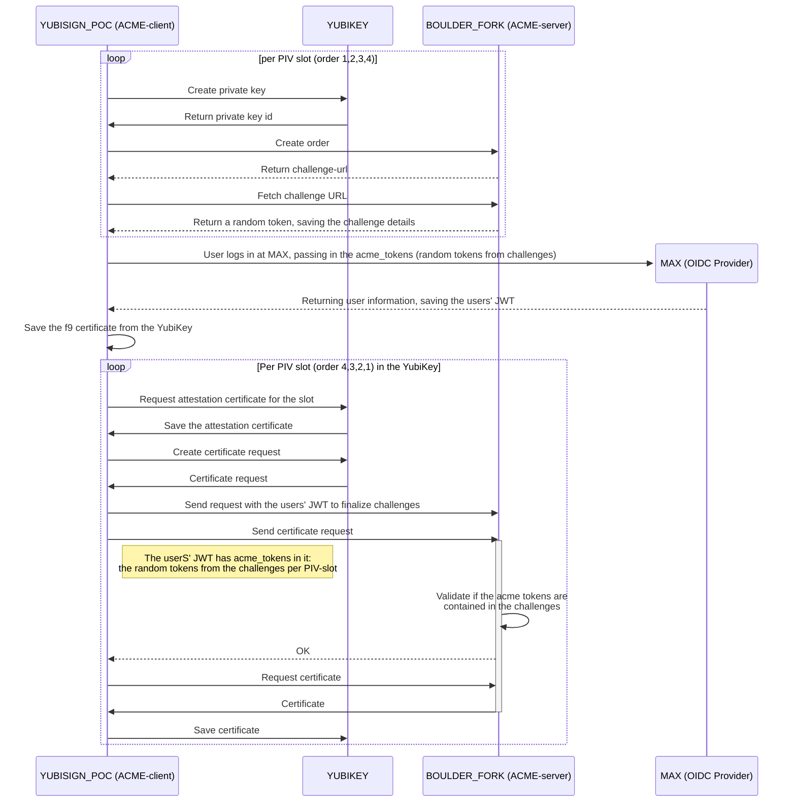

# acme-challenge flow

We are implementing a custom ACME-challenge, based on the projects requirements. ACME is a protocol, Automated Certificate Management Environment, that handles specific challenge validation and management of X.509 certificates. Usualy, this is for domains. In our scenario this is for personal identity.

## Flow

